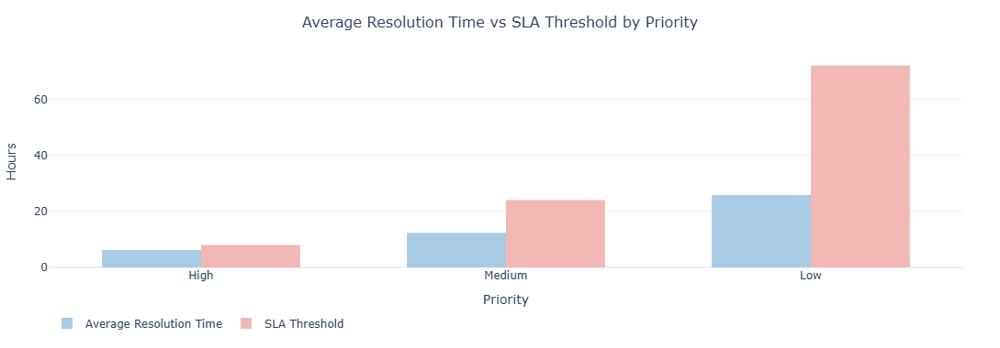
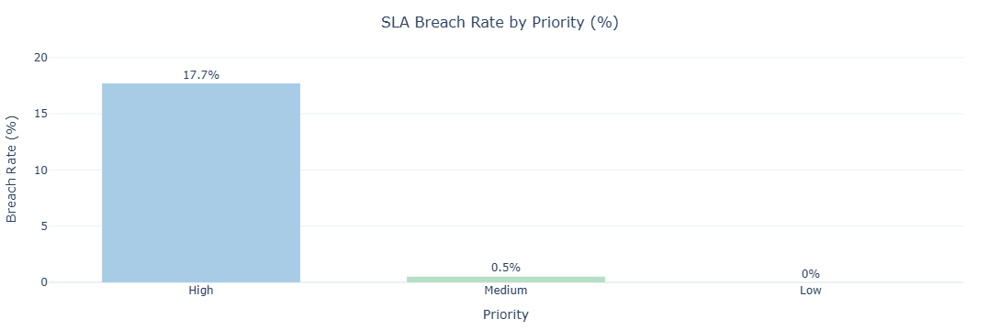
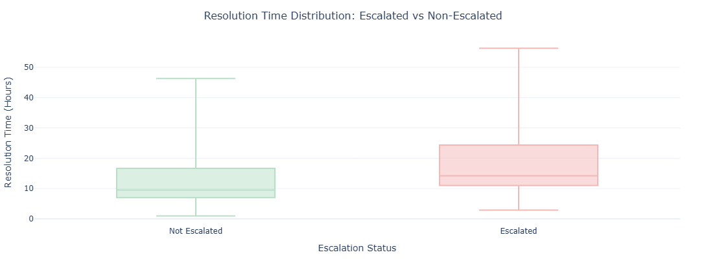
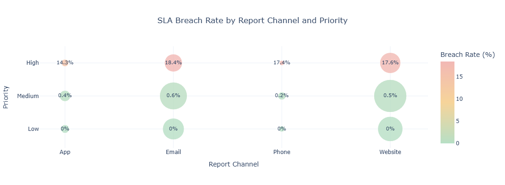
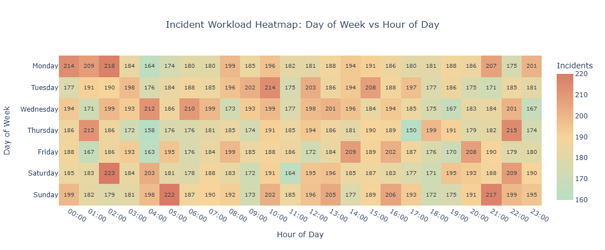

# Operational Efficiency Analysis
### Incident Workflow · SLA Performance · Process Bottleneck Analysis

## Project Overview

An operational efficiency analysis based on real-world incident management 
process data. The project investigates incident workflows, SLA compliance, 
escalation patterns, and process inefficiencies to provide data-driven 
operational recommendations.

## Interactive Version

GitHub may not correctly render Jupyter notebooks with interactive Plotly visualizations.

The full interactive version of this project is available here:

🌐 [Interactive Notebook](https://dariia-chornous.github.io/operational-efficiency-analysis/html/operational_efficiency_analysis.html)

If the notebook preview is not displayed correctly on GitHub, you can also view it via NBViewer:

🔗 [Open Notebook in NBViewer](https://nbviewer.org/github/dariia-chornous/operational-efficiency-analysis/blob/main/notebooks/operational_efficiency_analysis.ipynb)

## Dataset

- **Source:** [Kaggle – Process Mining Event Log – Incident Management](https://www.kaggle.com/datasets/albertopmd/process-mining-event-log-incident-management)
- **Size:** 31 588 unique incidents · 242 901 workflow events
- **Format:** CSV (semicolon-separated)

## Tools & Technologies

| Tool | Purpose |
|---|---|
| Python / Pandas / Plotly | Data processing, feature engineering, analysis, interactive visualizations |
| BigQuery / SQL | Centralized data storage, business queries, aggregations |
| Statistical Testing | Hypothesis testing and relationship analysis – t-test, Pearson correlation analysis |

## Business Questions

1. What is the incident distribution by priority and issue type?
2. What is the average resolution time depending on priority?
3. What percentage of incidents breach SLA?
4. How does the escalation process affect resolution time?
5. How does the report channel affect SLA breaches?
6. Which hours and days have the highest operational workload?
7. How does issue type affect resolution time?
8. What is the relationship between escalation count and resolution time?
9. How does resolution time affect Customer Satisfaction?
10. How do reopened incidents affect operational efficiency?

## Hypotheses

| Hypothesis | Result |
|---|---|
| Escalated incidents take longer to resolve | ✅ Confirmed (t=60.05, p<0.0001) |
| There is a positive correlation between escalation count and resolution time | ✅ Confirmed (r=0.38, p<0.0001) |
| Resolution time significantly affects CSAT | ❌ Rejected (r=–0.03) |

## Key Findings

- **SLA Performance:** High priority breach rate – **18%** (1 143 incidents).
  Medium and Low priority incidents rarely breach SLA (0,5% and 0%).
- **Escalation Impact:** 59,6% of all incidents were escalated. Escalated incidents
  demonstrate **51%** longer resolution time (11,5 h → 17,4 h), confirmed statistically.
- **Reopened Incidents:** 3,8% of incidents are reopened by customers and take
  **+58%** longer to resolve (23,3 h vs 14,7 h).
- **Workload:** Local peaks during night hours (00:00–02:00), including weekends,
  indicate a need for 24/7 staffing coverage.
- **Issue Type:** Bug incidents take the longest to resolve – **16,0 h**,
  followed by Performance Issues – **15,2 h**.
- **Report Channel:** The email channel shows the highest SLA breach rate among
  High priority incidents (18,4%), while the App channel performs best (14,3%).
- **Customer Satisfaction:** Resolution time has minimal impact on CSAT
  (r = –0.03). Customer satisfaction is likely driven by communication quality
  and incident complexity rather than speed of resolution.

## Key Visualizations











## Project Structure

```text
repository/
├── README.md
├── .gitignore
├── notebooks/
│   └── operational_efficiency_analysis.ipynb
├── html/
│   └── operational_efficiency_analysis.html
├── data/
│   └── README.md
├── images/
│   └── *.png
├── presentation/
│   ├── README.md
│   └── operational_efficiency_presentation.pdf
```

## Presentation

- 📊 [View Presentation](presentation/operational_efficiency_presentation.pdf)

## How to Run

1. Download the dataset from [Kaggle](https://www.kaggle.com/datasets/albertopmd/process-mining-event-log-incident-management)
2. Save the file to the `data/` folder as `incident_management.csv`
3. Configure BigQuery connection (Google Cloud credentials)
4. Open and run `notebooks/operational_efficiency_analysis.ipynb`
